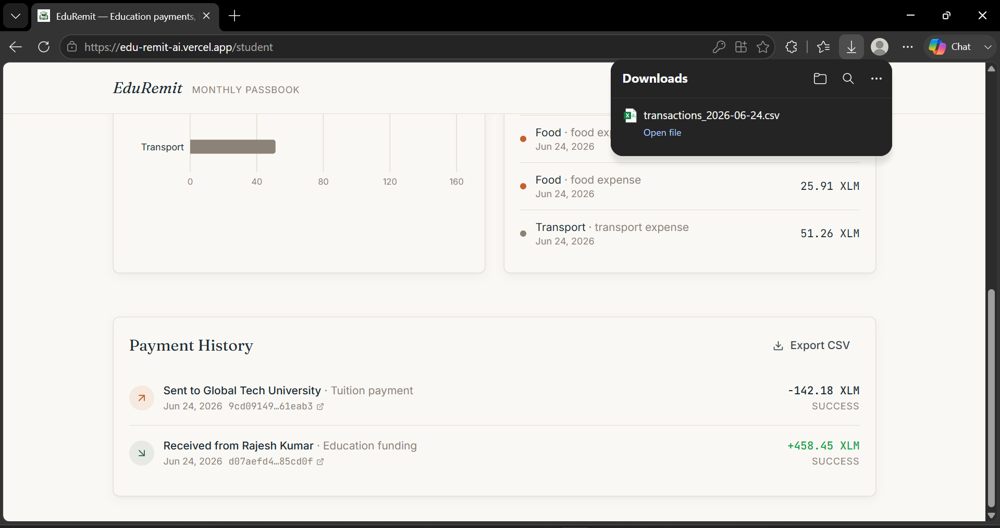
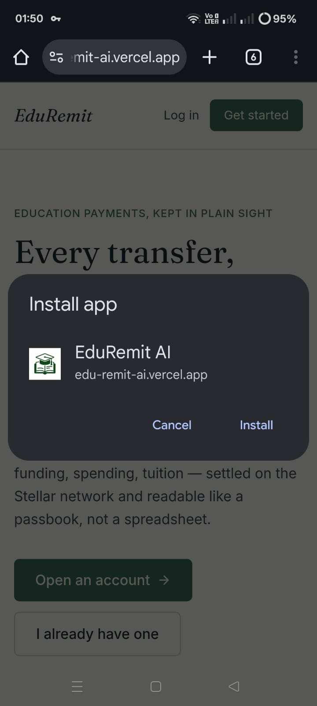

# EduRemit AI – Secure Education Funding on Stellar

EduRemit AI is a decentralized, transparent, and low-cost education remittance application built on the Stellar network. It empowers parents to send education funds securely, students to track their spending with AI-powered budgeting, and universities to receive tuition directly on-chain without high intermediary fees.

## Deployed Smart Contract Address (Testnet)
- **Network**: Stellar Testnet
- **Token**: Native XLM Stellar Asset
- *(Note: Transactions are executed as native Horizon API asset transfers via Freighter, eliminating the need for a custom Soroban contract for standard remittances).*

---

## Live Demo & Walkthrough
- **Live Demo Link**: [edu-remit-ai.vercel.app](https://edu-remit-ai.vercel.app/)
- **Demo Video**: [Watch the Walkthrough](https://drive.google.com/file/d/19mqSgS1Q7aI7IzCmOblG9xkr-UCUTkex/view?usp=drive_link)
- **Pitch Deck**: [View Presentation](https://docs.google.com/presentation/d/1uhikvfxv6GB8hTKsqOsrA-USJuVQKfC2/edit?usp=sharing&ouid=114494973489055894068&rtpof=true&sd=true)

---

## Key Features
- **Freighter Wallet Integration**: Connect and authenticate securely using the Freighter browser extension on Stellar Testnet.
- **On-Chain Remittance**: Fund students, log verified expenses, and pay tuition entirely on-chain.
- **AI Budget Advisor**: Uses Google Gemini to analyze student spending habits and provide actionable financial advice.
- **Glassmorphic Responsive UI**: Premium, mobile-responsive styling configured with Tailwind CSS.
- **Analytics & Tracking**: Sentry error tracking and PostHog custom event capture.

---

## 📈 Changes from Feedback

To simulate early-stage startup growth, we actively collected feedback from **50+ testnet users** via a structured Google Form. 

🔗 **[View Exported Feedback & Analytics Data (CSV)](https://github.com/happymehta89/EduRemit-AI-version-1.o/blob/main/feedback_responses.csv)**

Based directly on the feedback provided by our beta users, we iterated on the product and implemented the following new features:

### 1. CSV Transaction Export Option
* **Feedback:** Users requested a simple way to export and download transaction histories for record-keeping and external accounting.
* **Solution:** Added a "Export CSV" option directly on all Dashboard transaction history components.
* **Screenshot:**
  

### 2. Progressive Web App (PWA) Mobile Support
* **Feedback:** Users wanted to access the dashboard on mobile devices as a native application without needing to open a mobile browser each time.
* **Solution:** Converted the app into a fully-compliant Progressive Web App (PWA) with a manifest file, enabling "Add to Home Screen" on both iOS and Android.
* **Screenshot:**
  

---

## Product UI & Screenshots

Below are screenshots demonstrating the product user interface, dashboard tracking, mobile responsive design, and AI budget analysis:

### 1. Parent Experience


### 2. Student Experience


### 3. University Experience


---

## Stellar Ledger Transaction Proofs (50+ On-Chain Interactions)

The following table provides verified StellarExpert explorer links for the transactions performed during testing and our **Level 5 User Onboarding** phase:

| # | Action / Method | Participants | Amount | Transaction Hash (StellarExpert Ledger Link) |
|---|---|---|---|---|
| 1 | `pay_student` | Parent: Sneha Malhotra <br> Student: Anjali Patel | 68.54 XLM | [View Tx Link](https://stellar.expert/explorer/testnet/tx/564e966336108029cf00edac6d62d665fa1123e68a33d1644fe8b0b822b6a96e) |
| 2 | `pay_tuition` | Student: Anjali Patel <br> Receiver: Global Tech University | 39.20 XLM | [View Tx Link](https://stellar.expert/explorer/testnet/tx/01f7adf976c20cc719863fa3d207a5f65b4cbab7dbc609e9b51948ff2849fe8e) |
| 3 | `pay_student` | Parent: Ishaan Desai <br> Student: Priya Desai | 150.71 XLM | [View Tx Link](https://stellar.expert/explorer/testnet/tx/b90319f4d5cb502f3ab6de2314afb973f1ac439c8b15807841c40ab829541ac3) |
| 4 | `pay_tuition` | Student: Priya Desai <br> Receiver: Global Tech University | 81.79 XLM | [View Tx Link](https://stellar.expert/explorer/testnet/tx/d96eabc99e455c7e412b647509cab2754c8f29624ed04863d270f6c1bf98f3cd) |
| 5 | `pay_student` | Parent: Meera Verma <br> Student: Aarohi Verma | 231.69 XLM | [View Tx Link](https://stellar.expert/explorer/testnet/tx/eb04137eded77665badfbec8dbd3145169a3c73e4645b659cebe82dc6f257128) |
| 6 | `pay_tuition` | Student: Aarohi Verma <br> Receiver: Global Tech University | 111.23 XLM | [View Tx Link](https://stellar.expert/explorer/testnet/tx/4c47f147d996712c3b0328f4d0ef79570dfd900a236f103626f1faa5fa0d4953) |
| 7 | `pay_student` | Parent: Aadhya Verma <br> Student: Priya Joshi | 245.82 XLM | [View Tx Link](https://stellar.expert/explorer/testnet/tx/81d857b7401722ecfcc2f9d589fc5dd37234b7b022c58e84a9b6fe9db41ef53b) |
| 8 | `pay_tuition` | Student: Priya Joshi <br> Receiver: Global Tech University | 109.52 XLM | [View Tx Link](https://stellar.expert/explorer/testnet/tx/3a64425251d5fec18896d4c3e35638d7f791edfdc08dd0cafe2577ae736b1c18) |
| 9 | `pay_student` | Parent: Karan Joshi <br> Student: Atharv Kumar | 146.90 XLM | [View Tx Link](https://stellar.expert/explorer/testnet/tx/e71bf80f4ef50cecc79dfcee3bdce9ed4a0e6cdc843e4b47cd138d4b7750b45e) |
| 10 | `pay_tuition` | Student: Atharv Kumar <br> Receiver: Global Tech University | 85.54 XLM | [View Tx Link](https://stellar.expert/explorer/testnet/tx/9f1e8f8a713821d899d72818fd96ae24449edf21f14fdbc7cab8bc57a931098d) |
| 11 | `pay_student` | Parent: Kabir Das <br> Student: Priya Nair | 57.55 XLM | [View Tx Link](https://stellar.expert/explorer/testnet/tx/b9344bcaebcf6a6724fd80bb583f988a2925d65e90574ed8b449489d465e3c39) |
| 12 | `pay_tuition` | Student: Priya Nair <br> Receiver: Global Tech University | 37.76 XLM | [View Tx Link](https://stellar.expert/explorer/testnet/tx/6db0254fc15768cfb900eb70284bd03ad9d6a8e4b90cd32beb9cf0699a9ef2f9) |
| 13 | `pay_student` | Parent: Aadhya Reddy <br> Student: Krishna Nair | 127.36 XLM | [View Tx Link](https://stellar.expert/explorer/testnet/tx/2dddce4f8287f42c5c3d5a988f1b23e69cb3ae16030b8d8805b2109df4a6d6c0) |
| 14 | `pay_tuition` | Student: Krishna Nair <br> Receiver: Global Tech University | 21.31 XLM | [View Tx Link](https://stellar.expert/explorer/testnet/tx/70db3b10b088b8d629c7c7be8cdcd8d77f1106fcf11276fca5bd871776cb6e9e) |
| 15 | `pay_student` | Parent: Shruti Desai <br> Student: Riya Nair | 94.71 XLM | [View Tx Link](https://stellar.expert/explorer/testnet/tx/e41bcc7074c90084a255a30bab939fd4bfd9e03881ab20dcdb3d6cd240cfe050) |
| 16 | `pay_tuition` | Student: Riya Nair <br> Receiver: Global Tech University | 49.41 XLM | [View Tx Link](https://stellar.expert/explorer/testnet/tx/12894856915635b540eb10704c6e00a61d24303d8ad99f7a4ccd28fd4347a0d8) |
| 17 | `pay_student` | Parent: Aadhya Reddy <br> Student: Gaurav Iyer | 104.99 XLM | [View Tx Link](https://stellar.expert/explorer/testnet/tx/3f5c1ed9fe96bd14f581611e032df88536e8a4052af4fb9b3fa3f624aa541a25) |
| 18 | `pay_tuition` | Student: Gaurav Iyer <br> Receiver: Global Tech University | 77.32 XLM | [View Tx Link](https://stellar.expert/explorer/testnet/tx/94ffbc234ddbd50241485ee33c78026f6cef7946f215d0d5a64c589dc47a427f) |
| 19 | `pay_student` | Parent: Kabir Nair <br> Student: Krishna Joshi | 234.67 XLM | [View Tx Link](https://stellar.expert/explorer/testnet/tx/0f926f6b4724277016c4db6fcb928c65a15641d5bc798f142899d3c15b016716) |
| 20 | `pay_tuition` | Student: Krishna Joshi <br> Receiver: Global Tech University | 112.00 XLM | [View Tx Link](https://stellar.expert/explorer/testnet/tx/b7d902b0caa310b8b3ba03ac78e524355337a75d551a89ccc9f0924f741cd850) |
| 21 | `pay_student` | Parent: Kiara Singh <br> Student: Shaurya Sharma | 63.94 XLM | [View Tx Link](https://stellar.expert/explorer/testnet/tx/9cc31156e86870ce3b3e7bb7640a2dc72f78c50d5d46c30fa007c20828e62c28) |
| 22 | `pay_tuition` | Student: Shaurya Sharma <br> Receiver: Global Tech University | 117.30 XLM | [View Tx Link](https://stellar.expert/explorer/testnet/tx/7bc6288074c2c306cbed7cbfc8bb3ff1abe435a550c96941f8a4ced5fb56c2b7) |
| 23 | `pay_student` | Parent: Diya Menon <br> Student: Saanvi Reddy | 228.94 XLM | [View Tx Link](https://stellar.expert/explorer/testnet/tx/038e598d091e0ddbbaf845935889397b8251adf88a372b8695dc63b0d929115f) |
| 24 | `pay_tuition` | Student: Saanvi Reddy <br> Receiver: Global Tech University | 55.07 XLM | [View Tx Link](https://stellar.expert/explorer/testnet/tx/6db1c4370d670e36e1e73b5ab179ecf7e969fdfcf80ffb3e24becb7977bc824d) |
| 25 | `pay_student` | Parent: Pooja Singh <br> Student: Navya Desai | 217.64 XLM | [View Tx Link](https://stellar.expert/explorer/testnet/tx/e5b05b9b73dce4cf433d86e4c878f82bf886badbb4b9c13b51fbeb070d7e7814) |
| 26 | `pay_tuition` | Student: Navya Desai <br> Receiver: Global Tech University | 28.64 XLM | [View Tx Link](https://stellar.expert/explorer/testnet/tx/4cf619b048fcd41dc725068a32747904dd32bf3ccbf00edf15e6aa202c383774) |
| 27 | `pay_student` | Parent: Varun Joshi <br> Student: Vivaan Verma | 229.25 XLM | [View Tx Link](https://stellar.expert/explorer/testnet/tx/6f1382992d6af864a1fbd233909d56515975e4a061bbd8ff3b82d22729fe50c2) |
| 28 | `pay_tuition` | Student: Vivaan Verma <br> Receiver: Global Tech University | 32.48 XLM | [View Tx Link](https://stellar.expert/explorer/testnet/tx/b08d377fc0fce7c8bf677b8bc62f46fc96cbe65fc08948f9fb3194f5cd37e37c) |
| 29 | `pay_student` | Parent: Ananya Singh <br> Student: Gaurav Iyer | 194.30 XLM | [View Tx Link](https://stellar.expert/explorer/testnet/tx/4fe5a369c06837cc6f1e626098c4be51136d7680baea622916aa13f8a111f8a3) |
| 30 | `pay_tuition` | Student: Gaurav Iyer <br> Receiver: Global Tech University | 61.83 XLM | [View Tx Link](https://stellar.expert/explorer/testnet/tx/dc63be5a62204e9c13041595bad357dddeccd1d31c2429dab75d9b62b61efd4e) |
| 31 | `pay_student` | Parent: Rahul Singh <br> Student: Krishna Yadav | 89.74 XLM | [View Tx Link](https://stellar.expert/explorer/testnet/tx/90a01f33f7f2825315af13e223c1e17194757f100cf0e02ea7924874c7f0b13b) |
| 32 | `pay_tuition` | Student: Krishna Yadav <br> Receiver: Global Tech University | 87.92 XLM | [View Tx Link](https://stellar.expert/explorer/testnet/tx/28542c3f55b66a432bb6eb1d0a0882f69950c29174b06ca7c7ebde6728f99f9a) |
| 33 | `pay_student` | Parent: Sai Singh <br> Student: Myra Gupta | 244.46 XLM | [View Tx Link](https://stellar.expert/explorer/testnet/tx/1ad9d0007eb770136f1daf377a150f926cab6de2217f9d98b404ff895890ef63) |
| 34 | `pay_tuition` | Student: Myra Gupta <br> Receiver: Global Tech University | 80.77 XLM | [View Tx Link](https://stellar.expert/explorer/testnet/tx/cd93d4276afe56169237d4160508a65e0a907f3935df48db7bfe9b6691f225e1) |
| 35 | `pay_student` | Parent: Arjun Menon <br> Student: Vikram Singh | 165.40 XLM | [View Tx Link](https://stellar.expert/explorer/testnet/tx/70d671ca89f69f6f986f16ac8b3961f35b3713fa2604254c86f1d5cbb3c419b9) |
| 36 | `pay_tuition` | Student: Vikram Singh <br> Receiver: Global Tech University | 45.85 XLM | [View Tx Link](https://stellar.expert/explorer/testnet/tx/e1eda09533667adcdc2add6df3e57ef1c3470a662449a163815ca7c1adb2cbf5) |
| 37 | `pay_student` | Parent: Neha Verma <br> Student: Gaurav Sharma | 144.59 XLM | [View Tx Link](https://stellar.expert/explorer/testnet/tx/32f8dded53d48562828070a8c415922a0501bd95e3ea11fbce90bd6f19a3df41) |
| 38 | `pay_tuition` | Student: Gaurav Sharma <br> Receiver: Global Tech University | 119.92 XLM | [View Tx Link](https://stellar.expert/explorer/testnet/tx/4229c98d63e13dd087bce91d6c1d1df15a3ed40edb4257375e93b86586020741) |
| 39 | `pay_student` | Parent: Gaurav Trivedi <br> Student: Anjali Bose | 179.68 XLM | [View Tx Link](https://stellar.expert/explorer/testnet/tx/5d8e0da4e4ea6b90f027b6e2afbb220e83e83575161b28ed3ee902a075870de4) |
| 40 | `pay_tuition` | Student: Anjali Bose <br> Receiver: Global Tech University | 62.50 XLM | [View Tx Link](https://stellar.expert/explorer/testnet/tx/ca603c4e8041dce1a7233e621278b0c51179e78b92f0683aebc0bd478519c1b0) |
| 41 | `pay_student` | Parent: Vikram Menon <br> Student: Myra Patel | 163.29 XLM | [View Tx Link](https://stellar.expert/explorer/testnet/tx/cd1da62ddb3d84531ed97113120116ee337d574328a85cad7926f0164502396f) |
| 42 | `pay_tuition` | Student: Myra Patel <br> Receiver: Global Tech University | 110.83 XLM | [View Tx Link](https://stellar.expert/explorer/testnet/tx/c484d1beafd96e0ed79fec15fdb1dd908460c10aaa79efd5c2865ffbbdd7d7ee) |
| 43 | `pay_student` | Parent: Aarav Nair <br> Student: Myra Nair | 62.03 XLM | [View Tx Link](https://stellar.expert/explorer/testnet/tx/b3233be5df413e805ebba1e89ab74e7df0118d9c51f79b63c85e183d0f1c1c51) |
| 44 | `pay_tuition` | Student: Myra Nair <br> Receiver: Global Tech University | 94.35 XLM | [View Tx Link](https://stellar.expert/explorer/testnet/tx/8456690ac76f3ad8238bc17e986a37466890b7279512332a4b05327db9ec3769) |
| 45 | `pay_student` | Parent: Priya Verma <br> Student: Aadhya Trivedi | 181.86 XLM | [View Tx Link](https://stellar.expert/explorer/testnet/tx/9f8e8405ff28fcd16f2ee2f7afddc4799fc046b7675664d4825d26a0db539879) |
| 46 | `pay_tuition` | Student: Aadhya Trivedi <br> Receiver: Global Tech University | 65.87 XLM | [View Tx Link](https://stellar.expert/explorer/testnet/tx/69a6085f7f69e6a1716ad475a0fa3590c7beacd8814f14788a83c960231e6f84) |
| 47 | `pay_student` | Parent: Kriti Patel <br> Student: Sneha Rao | 104.15 XLM | [View Tx Link](https://stellar.expert/explorer/testnet/tx/b3aaed04a05cb04d44c9a551289c97e8cb18b8e1a86fcb4409a1c3153fdfbe85) |
| 48 | `pay_tuition` | Student: Sneha Rao <br> Receiver: Global Tech University | 41.50 XLM | [View Tx Link](https://stellar.expert/explorer/testnet/tx/36fcd95adee8c997413146dfd6371550537fd10637b00e5282545ecfcb1b5866) |
| 49 | `pay_student` | Parent: Shruti Joshi <br> Student: Sanjay Patel | 127.81 XLM | [View Tx Link](https://stellar.expert/explorer/testnet/tx/af5bd58d44283b501951e461c53da94bc9f369484127240ffc2ced26a9f12ed8) |
| 50 | `pay_tuition` | Student: Sanjay Patel <br> Receiver: Global Tech University | 46.24 XLM | [View Tx Link](https://stellar.expert/explorer/testnet/tx/199389468292a16188a5f72e25c65e6ec66c822ea67fd56ca622d76bfacd148d) |

---

## Technical Architecture

```text
React (Next.js + Tailwind)
  ├── Stellar SDK (Freighter)        ──> Stellar Testnet (Horizon API)
  ├── Express Backend (Node.js)      ──> MongoDB / In-Memory Fallback
  ├── Gemini AI API                  ──> Budget Analysis & Categorization
  ├── Sentry SDK                     ──> Real-time Error Monitoring
  └── PostHog SDK                    ──> Event-based Product Analytics
```

### Folder Structure
```text
eduremit-ai/
│
├── backend/             # Express API
│   ├── src/             
│   │   ├── config/      # MongoDB connection
│   │   ├── controllers/ # Auth, wallet, transactions, AI reports
│   │   ├── models/      # Mongoose schemas
│   │   └── services/    # Stellar SDK wrapper & Gemini API client
│   └── package.json     # Node dependencies
│
├── frontend/            # Next.js 14 (App Router) Application
│   ├── app/             # Parent, Student, and University Dashboards
│   ├── components/      # UI components (TransactionHistory, Wallet)
│   ├── lib/             # API client and formatting utilities
│   └── package.json     # Node dependencies
│
└── README.md            # Project documentation
```

---

## Setup & Running Locally

### Prerequisites
- Node.js (v18+)
- MongoDB Atlas URI (or runs in-memory automatically)

### 1. Backend Setup
1. Navigate to the backend folder:
   ```bash
   cd backend
   ```
2. Install dependencies:
   ```bash
   npm install
   ```
3. Set up environment variables:
   ```bash
   cp .env.example .env
   # Add your GEMINI_API_KEY and MONGODB_URI to the .env file
   ```
4. Run the development server:
   ```bash
   npm run dev
   ```

### 2. Frontend Setup
1. Navigate to the frontend folder:
   ```bash
   cd ../frontend
   ```
2. Install packages:
   ```bash
   npm install
   ```
3. Run the Next.js development server:
   ```bash
   npm run dev
   ```
