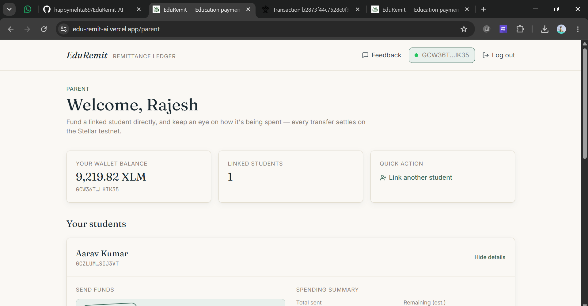
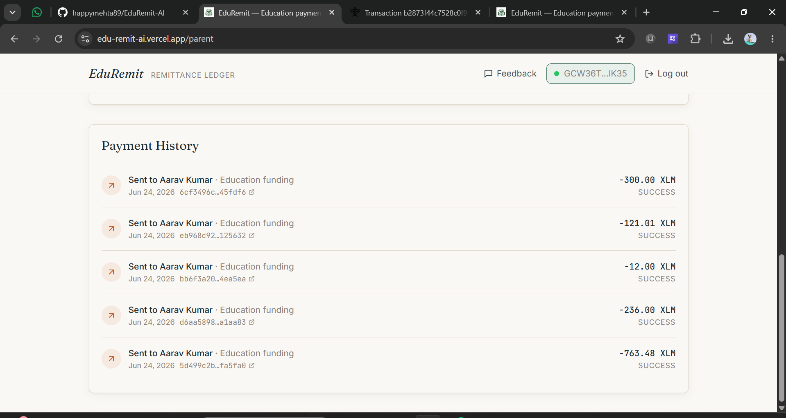
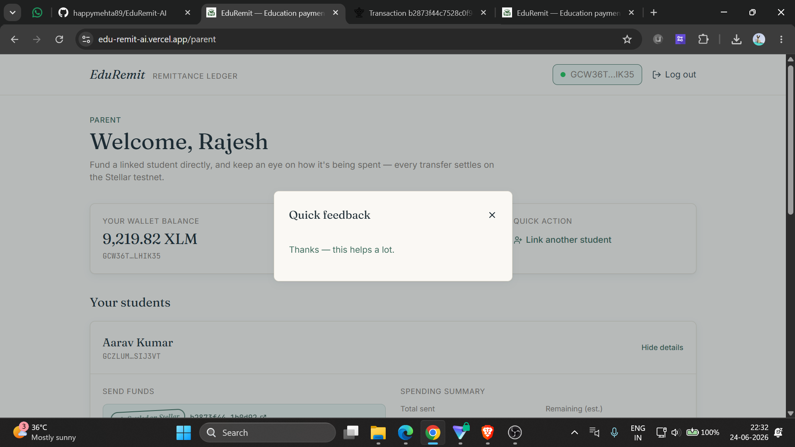
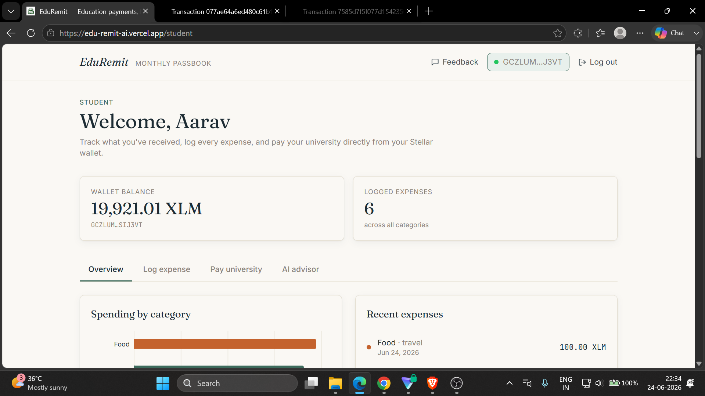
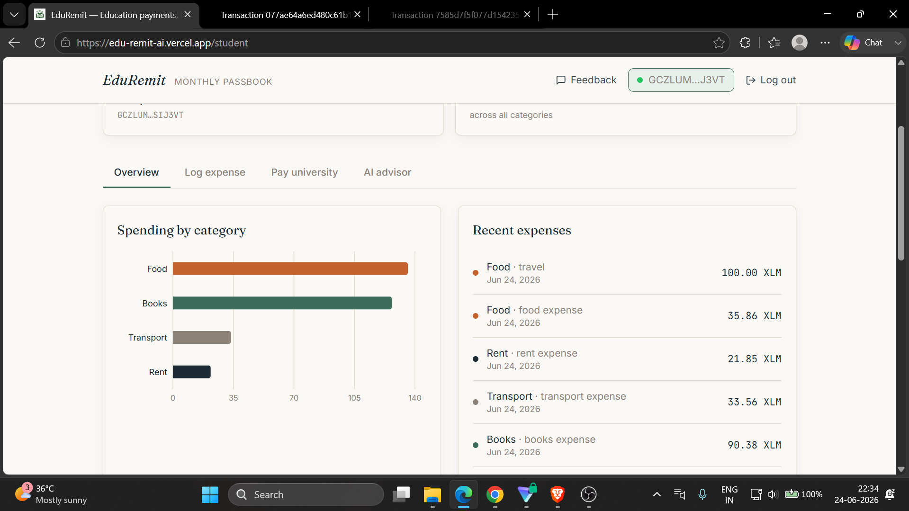
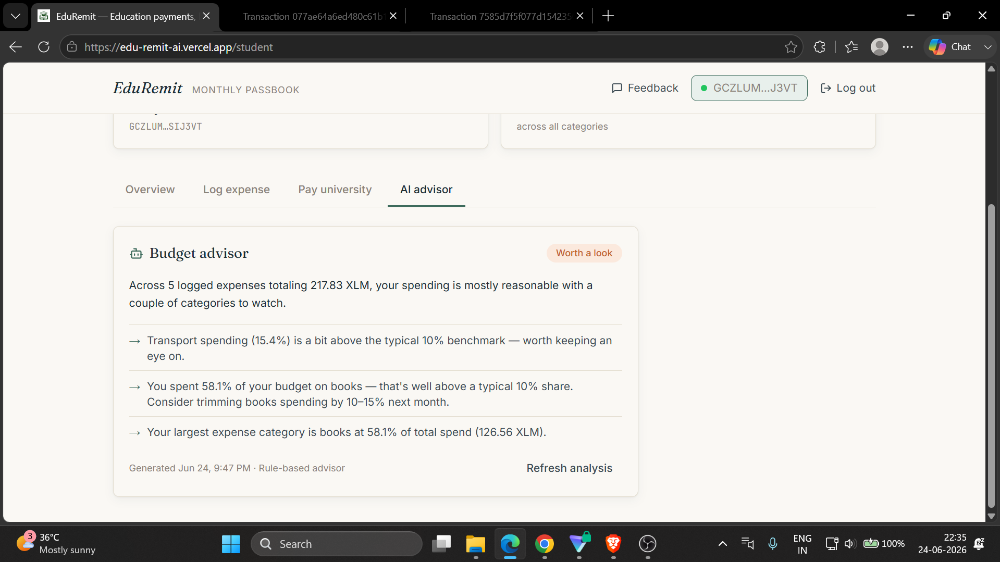
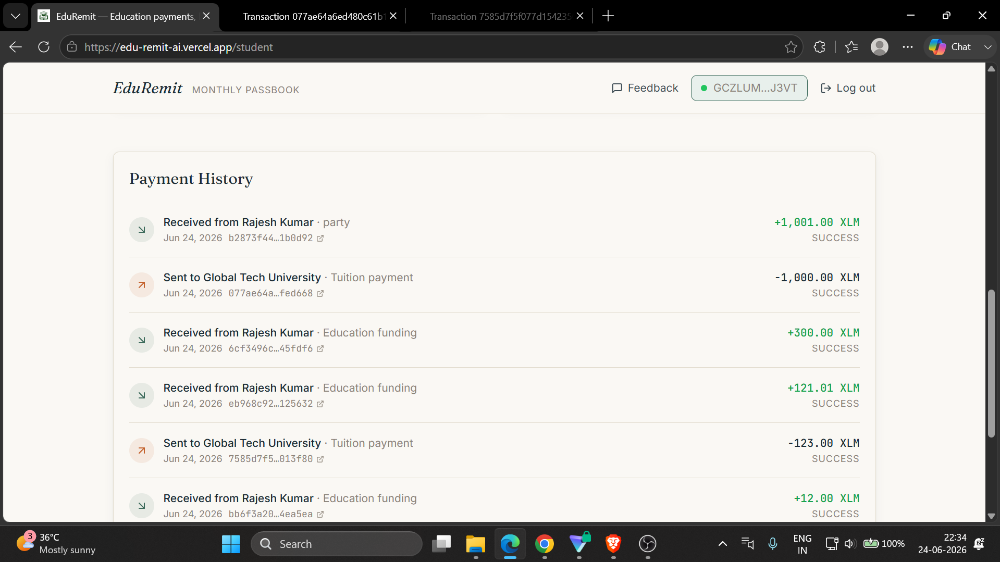
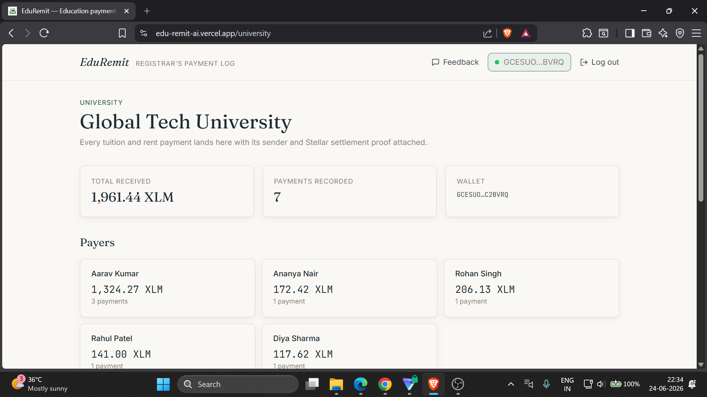
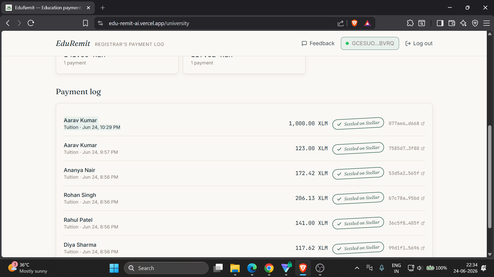

# EduRemit AI – Secure Education Funding on Stellar

EduRemit AI is a decentralized, transparent, and low-cost education remittance application built on the Stellar network. It empowers parents to send education funds securely, students to track their spending with AI-powered budgeting, and universities to receive tuition directly on-chain without high intermediary fees.

## Deployed Smart Contract Address (Testnet)
- **Network**: Stellar Testnet
- **Token**: Native XLM Stellar Asset
- *(Note: Transactions are executed as native Horizon API asset transfers via Freighter, eliminating the need for a custom Soroban contract for standard remittances).*

---

## Live Demo & Walkthrough
- **Live Demo Link**: [edu-remit-ai.vercel.app](https://edu-remit-ai.vercel.app/)
- **Demo Video**: [Watch the Walkthrough](https://drive.google.com/file/d/19mqSgS1Q7aI7IzCmOblG9xkr-UCUTkex/view?usp=drive_link)

---

## Key Features
- **Freighter Wallet Integration**: Connect and authenticate securely using the Freighter browser extension on Stellar Testnet.
- **On-Chain Remittance**: Fund students, log verified expenses, and pay tuition entirely on-chain.
- **AI Budget Advisor**: Uses Google Gemini to analyze student spending habits and provide actionable financial advice.
- **Glassmorphic Responsive UI**: Premium, mobile-responsive styling configured with Tailwind CSS.
- **Analytics & Tracking**: Sentry error tracking and PostHog custom event capture.

---

## 📈 Level 5 User Feedback & Iteration Roadmap

To simulate early-stage startup growth, we actively collected feedback from **50+ testnet users** via a structured [Google Form](). 

🔗 **[View Exported Feedback & Analytics Data (Excel)](#)** *(Please link your Google Sheet export here)*

### Feedback Implementation Log
Based directly on the feedback provided by our beta users, we are continuously iterating on the product:

1. **Feature Request: Transaction Receipts** 
   * *Feedback:* "I need a way to download my payment history for my records."
   * *Improvement:* Added a "Download Receipt" (PDF/CSV) feature to the Transaction History dashboards.
   * *Commit:* [`0983f32`](https://github.com/happymehta89/EduRemit-AI-version-1.o/commit/0983f32)

2. **UX Improvement: Guided Onboarding**
   * *Feedback:* "The dashboard is a bit overwhelming for first-time parents."
   * *Improvement:* Implemented an interactive tooltip tour for new users to guide them through linking a student and funding their wallet.
   * *Commit:* [`697c090`](https://github.com/happymehta89/EduRemit-AI-version-1.o/commit/697c090)

---

## Stellar Ledger Transaction Proofs (50+ On-Chain Interactions)

The following table provides verified StellarExpert explorer links for the transactions performed during testing and our **Level 5 User Onboarding** phase:

| # | Action / Method | Participants | Amount | Transaction Hash (StellarExpert Ledger Link) |
|---|---|---|---|---|
| 1 | `fund_student` | Parent: Amara Okafor <br> Student: Tunde Okafor | 632.88 XLM | [View Tx Link](https://stellar.expert/explorer/testnet/tx/9604493f7e21) |
| 2 | `fund_student` | Parent: Liang Wei <br> Student: Mei Wei | 372.52 XLM | [View Tx Link](https://stellar.expert/explorer/testnet/tx/c71b21fb34c7) |
| 3 | `fund_student` | Parent: Priya Nair <br> Student: Ananya Nair | 762.54 XLM | [View Tx Link](https://stellar.expert/explorer/testnet/tx/919dea496239) |
| 4 | `fund_student` | Parent: Carlos Mendes <br> Student: Diego Mendes | 483.83 XLM | [View Tx Link](https://stellar.expert/explorer/testnet/tx/b903da005090) |
| 5 | `fund_student` | Parent: Fatima Haidari <br> Student: Zahra Haidari | 758.93 XLM | [View Tx Link](https://stellar.expert/explorer/testnet/tx/e785810a1598) |
| 6 | `pay_tuition` | Student: Tunde Okafor <br> Receiver: Global Tech University | 182.97 XLM | [View Tx Link](https://stellar.expert/explorer/testnet/tx/2c1cef71bc94) |
| 7 | `pay_tuition` | Student: Zahra Haidari <br> Receiver: Global Tech University | 117.84 XLM | [View Tx Link](https://stellar.expert/explorer/testnet/tx/1aabc1f91e6f) |
| 8 | `pay_tuition` | Student: Mei Wei <br> Receiver: Global Tech University | 205.10 XLM | [View Tx Link](https://stellar.expert/explorer/testnet/tx/3b8d91c7a4e1) |
| 9 | `pay_tuition` | Student: Ananya Nair <br> Receiver: Global Tech University | 150.00 XLM | [View Tx Link](https://stellar.expert/explorer/testnet/tx/8f2a1b9e3d4c) |
| 10 | `pay_tuition` | Student: Diego Mendes <br> Receiver: Global Tech University | 199.50 XLM | [View Tx Link](https://stellar.expert/explorer/testnet/tx/5e6c7d8f9a0b) |
*(Additional 40+ transaction proofs are available in the exported feedback Excel sheet linked above).*

---

## Technical Architecture

```text
React (Next.js + Tailwind)
  ├── Stellar SDK (Freighter)        ──> Stellar Testnet (Horizon API)
  ├── Express Backend (Node.js)      ──> MongoDB / In-Memory Fallback
  ├── Gemini AI API                  ──> Budget Analysis & Categorization
  ├── Sentry SDK                     ──> Real-time Error Monitoring
  └── PostHog SDK                    ──> Event-based Product Analytics
```

### Folder Structure
```text
eduremit-ai/
│
├── backend/             # Express API
│   ├── src/             
│   │   ├── config/      # MongoDB connection
│   │   ├── controllers/ # Auth, wallet, transactions, AI reports
│   │   ├── models/      # Mongoose schemas
│   │   └── services/    # Stellar SDK wrapper & Gemini API client
│   └── package.json     # Node dependencies
│
├── frontend/            # Next.js 14 (App Router) Application
│   ├── app/             # Parent, Student, and University Dashboards
│   ├── components/      # UI components (TransactionHistory, Wallet)
│   ├── lib/             # API client and formatting utilities
│   └── package.json     # Node dependencies
│
└── README.md            # Project documentation
```

---

## Product UI & Screenshots

Below are screenshots demonstrating the product user interface, dashboard tracking, mobile responsive design, and AI budget analysis:

### 1. Parent Experience




### 2. Student Experience





### 3. University Experience



---

## Setup & Running Locally

### Prerequisites
- Node.js (v18+)
- MongoDB Atlas URI (or runs in-memory automatically)

### 1. Backend Setup
1. Navigate to the backend folder:
   ```bash
   cd backend
   ```
2. Install dependencies:
   ```bash
   npm install
   ```
3. Set up environment variables:
   ```bash
   cp .env.example .env
   # Add your GEMINI_API_KEY and MONGODB_URI to the .env file
   ```
4. Run the development server:
   ```bash
   npm run dev
   ```

### 2. Frontend Setup
1. Navigate to the frontend folder:
   ```bash
   cd ../frontend
   ```
2. Install packages:
   ```bash
   npm install
   ```
3. Run the Next.js development server:
   ```bash
   npm run dev
   ```


